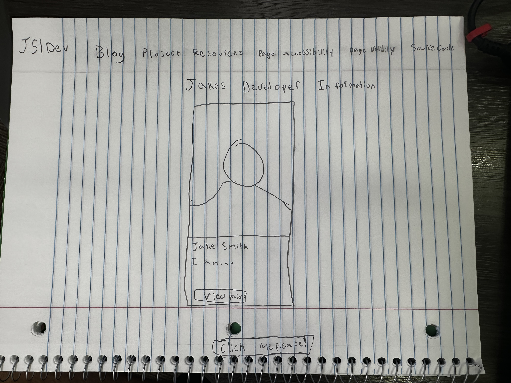

# znasser46
Zachary Nasser's repo

##User Story

As a visitor of this website, I want to be able to review the developers information, so that I can gain insight about their capabilities.

## Overview and Map
This is a developer website that includes a homepage, blog, projects, and resources.

index.html - home
blog - blog posts
projects - project descriptions and demos
resources - list of resources and tools

## Wireframe

## How to view
https://znasser46.github.io/znasser46/

## Code Snippet
'''.dev-card a:hover {
  background-color: lightskyblue;
} '''

Changes the background color of the anchor to light sky blue when it is being hovered over, specifically for the dev card.

## Credit/Disclosure
Navigation and cards were derived from bootstrap website

Built with HTML, CSS, and JavaScript

